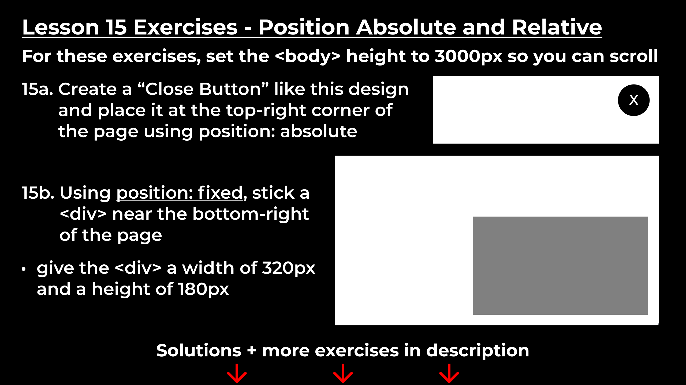
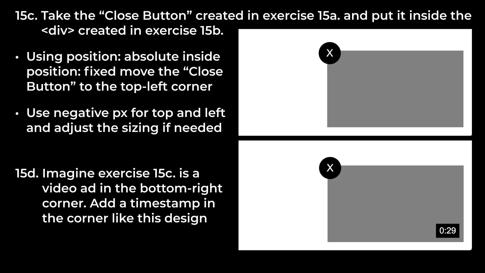
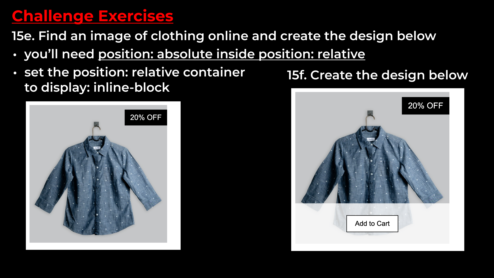

# Exercise 15

- Click the image to see **html** file  

- Click the image to see **css** file  

## Note:  
More information here: [**CSS Layout - The position Property**](https://www.w3schools.com/css/css_positioning.asp)
